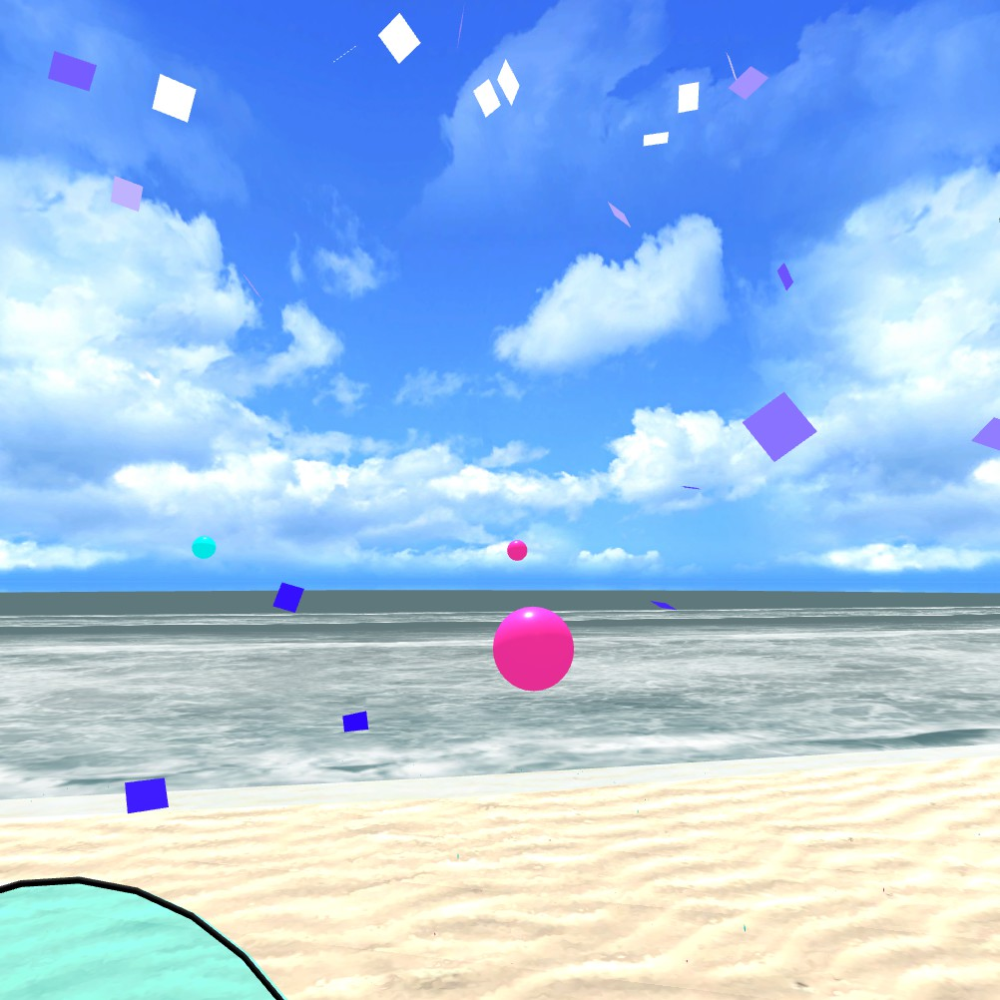
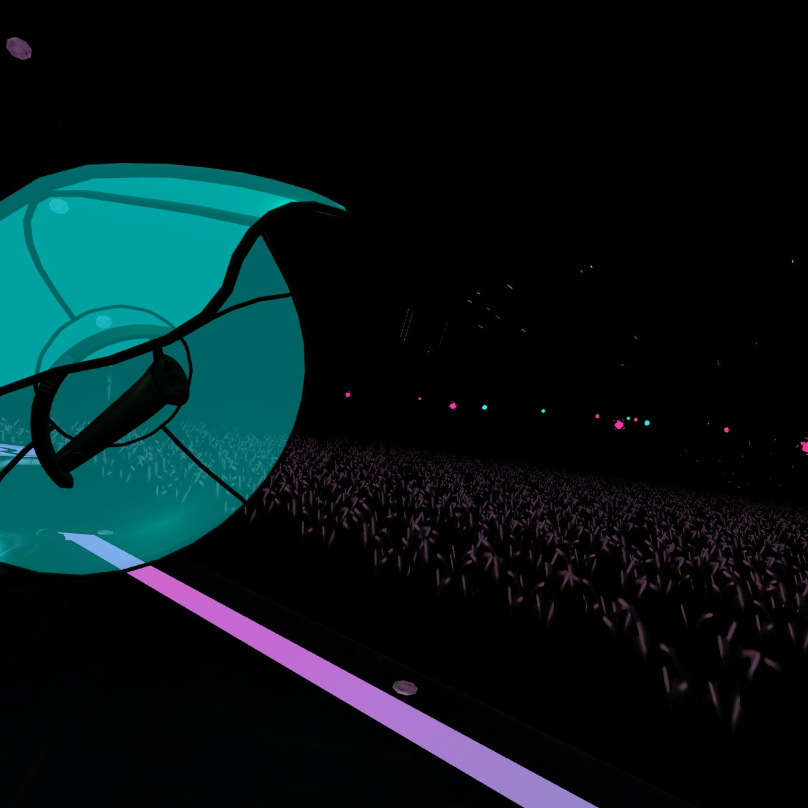
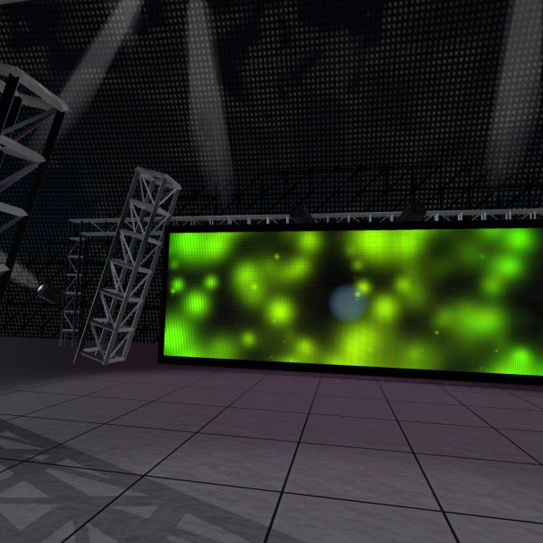

# Breakdance Beach

This modpack contains a series of modifications to the VR Rhythm Game Audioshield after years of manually editing the core game assembly after every new release. This pack makes use of harmony and bepinex to inject these tweaks and modifications into the core game assembly. The rich modding communities of other games have inspired me to start my own project, to really push what is possible in Audioshield as it is my favorite VR game. I am unsure how far this project will get, or if I will be able to make a reproducable installation method at this point, but my code is here if you want to take the initiative. Realistically, taking a page from beatsaber's book, to make this easier to work with I'd take a page from beatsaber's book and break this into an "Audioshield API" to build my mods ontop of. For now though, this will stay as a single assembly.

## Current Features

- Load content from unity asset bundles in each stage's folder. This allows for more "professional" customization without needing to modify lua files to be just right. Stages are able to contain dynamic content such as lights that change brightness/color based on the intensity of the current song, and models that cycle through blendshapes just as they do throgh LUA. This also allows for some customizations that were not possible with just the lua stage editor such as the creation of particle systems, and easier loading/manipulation of shaders.
- Randomize the order of songs in each folder of "My Music" instead of sorting by filename, ensuring no songs get buried at the bottom of the list, and you'll get a fresh selection of content at the top.

## Stage Images

Here's some images of stages that have been made possible with the use of the asset bundle loader. All stages shown are using models and textures from MMD stage models. I do not plan to redistribute as I do not own the rights to the models used, however I do plan to make some stages fully from scratch. 

